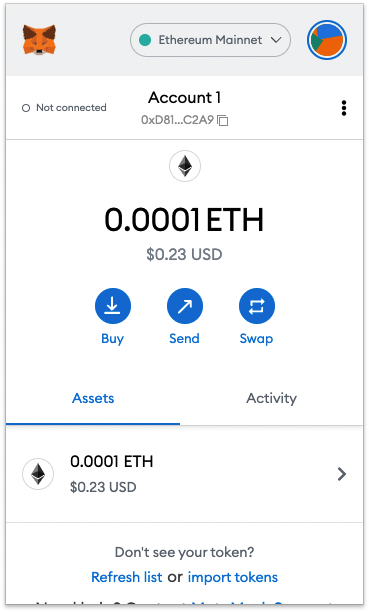
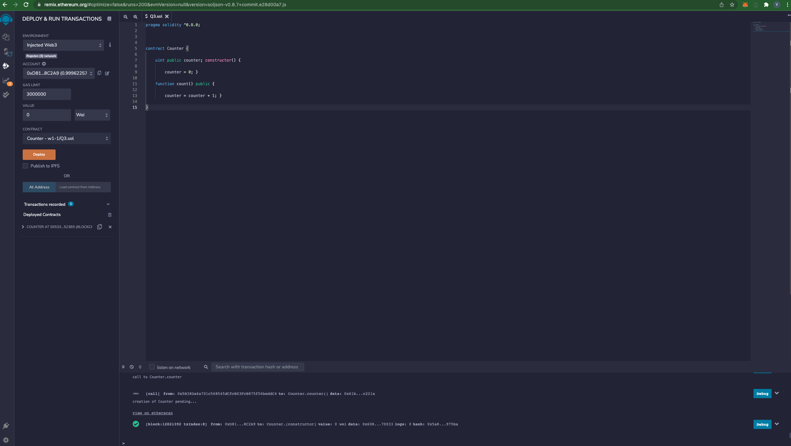
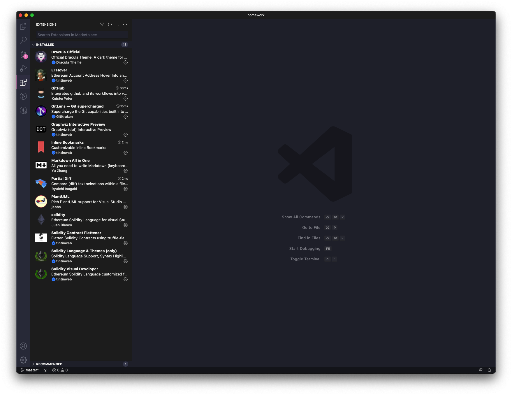

# W1-1作业：


* Q1 - 安装 Metamask、并创建好账号
	
	

* Q2 - 执行一次转账

	https://ropsten.etherscan.io/tx/0xa95f9830b3a2c6b0df7becc39a47412ad8683451f3e2bc8224921453e7f5d7f2

* Q3 - 使用 Remix 创建任意一个合约
	
	See q3 Folder
	
	https://ropsten.etherscan.io/tx/0x9509d362a44d3dbed608dc2c48e60f5802351e97a9ef8f8f43196c1f2b68f7e8


* Q4 - VSCode IDE 开发环境配置



	


* Q5 - 使用 Truffle 部署 Counter 合约 到 test 网络（goerli）（提交交易 hash）


	
	See q5 Folder

	https://ropsten.etherscan.io/tx/0x6d6eb6e56c73da2608a72ccf4ffaf4428ea1d5ed79c30e1950f1f1dc4480490d


* Q6 - 编写一个测试用例

	See q5 Folder

# W1-2作业：


* Q7 - 使用Hardhat部署修改后的Counter


	
	https://ropsten.etherscan.io/tx/0x769d8c57660acbb26db5ffeb9a291efd2ebbf32c26bf17aa8abfa58fa5557474

* Q8 - 使用Hardhat测试Counter



	See q7 Folder


* Q9 - 写一个脚本调用count()

	See q7 Folder
