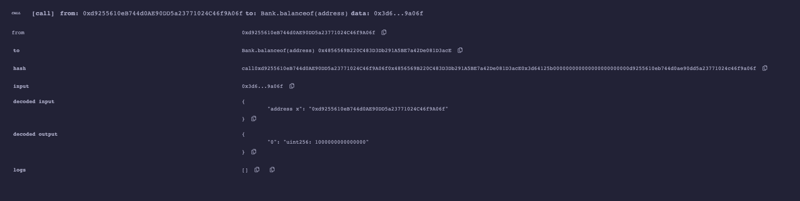

# W2 作业



W2_1作业


* Q1 - 编写⼀个Bank合约


[https://ropsten.etherscan.io/address/0x4856569b220c483d3db291a5be7a42de081d3ace]

* Q2 - 通过 Metamask 向Bank合约转账ETH


[https://ropsten.etherscan.io/tx/0x57409ab64002784d55e4ab8963859d252a934536ccee89ad7fee91bf11297fa8]


* Q3 - 在Bank合约记录每个地址转账⾦额






* Q4 - 编写 Bank合约withdraw(), 实现提取出所有的 ETH

[https://ropsten.etherscan.io/tx/0xa48c003c66f1478ff82a2f9b5e833b9cb0f3ca1f3b73929b6800f962678b275a]



W2_2作业


* Q5 - 编写合约Score，⽤于记录学⽣（地址）
	* 仅有⽼师（⽤modifier权限控制）可以添加和修改学⽣分数
	* 分数不可以⼤于 100 

 [https://ropsten.etherscan.io/address/0xa0aab3bd709361ddd2004a60b18d1c23dfc0dc54]



* Q6 - 编写合约 Teacher 作为⽼师，通过 IScore 接⼝调⽤修改学⽣分数


[https://ropsten.etherscan.io/tx/0x8b17b2d4a868f1c89ddbd335439e3af5f87dc1aca67ada0d2ce75db1ae88e269]



